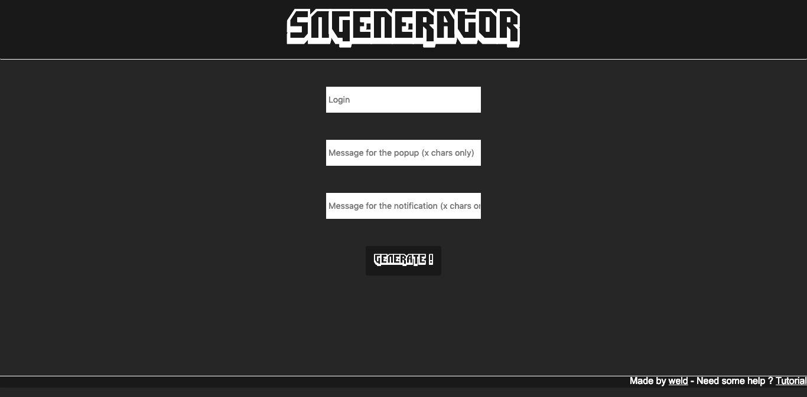

# SendNotifGenerator for Twitch

Available on Github Pages:  
    - [SNGenerator](https://atomicwelding.github.io/SendNotifGenerator-for-Twitch/front/index.html) (/!\ Not available yet)

## Tutorial
Work in progress

## Server API

Send a GET Request with 3 params;   
    - Login : Username of the Twitch Streamer   
    - Popup : The message that will be displayed on the popup.  
    - Notif : The message that will de displayed on the Notification 

To see what it should look like, you can see my first twitch extension [here](https://github.com/atomicwelding/AlertYourPopcorn)

## Screenshots

#### Website

